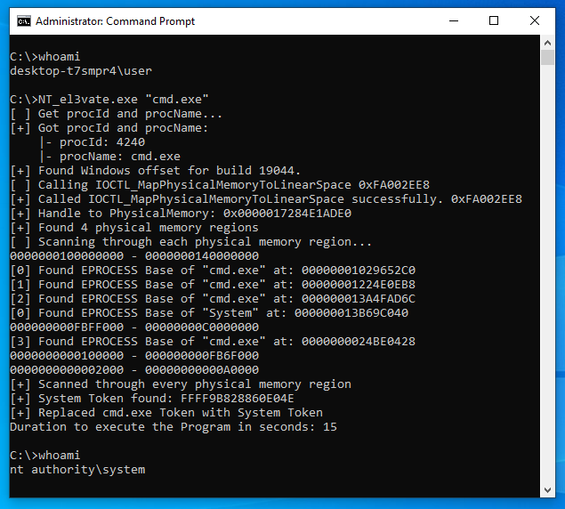

# NT_el3vate
A utility to elevate any process to "nt authority\system".

## Usage
First you need to load the driver UCOREW64.SYS (SHA-256:a7c8f4faf3cbb088cac7753d81f8ec4c38ccb97cd9da817741f49272e8d01200) onto your system.
```
sc create UCOREW64 binPath=[path to UCOREW64.SYS file] type=kernel
sc start UCOREW64
```
To use the program:
```.\NT_el3vate.exe <processID / processName>```

[](demo)

## How does it work?
This program uses a signed driver UCOREW64.SYS to access ZwMapViewOfSection() and ZwUnmapViewOfSection().
Using these functions, the program searches for the EPROCESS struct in physical memory, taking advantage of the ability to map arbitrary physical memory to the userland program.
In order to get the physical memory layout, an information leak is used by calculating the memory layout of the registry entry "HARDWARE\\RESOURCEMAP\\System Resources\\Physical Memory" in GetPhysicalMemoryLayout().
Once the EPROCESS structure has been found for both SYSTEM and <targetProcess>, the system token is copied over to the <targetProcess>, effectively elevating the process to SYSTEM.

## Threat model
This program does not pose any threat to Windows security as the program requires Administrator privileges to begin with. According to Microsoft: "Administrator-to-kernel is not a security boundary." (https://www.microsoft.com/en-us/msrc/windows-security-servicing-criteria)
